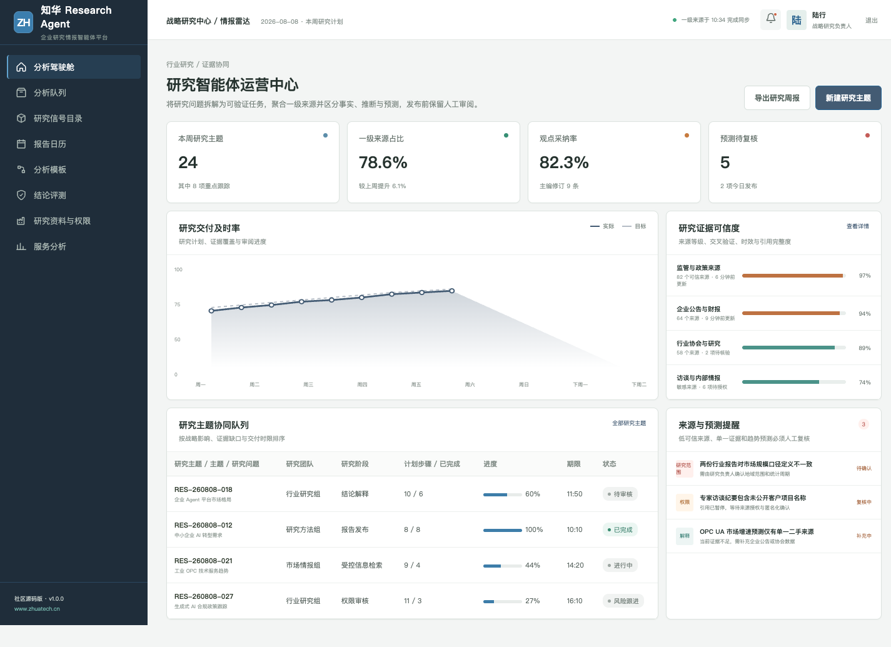
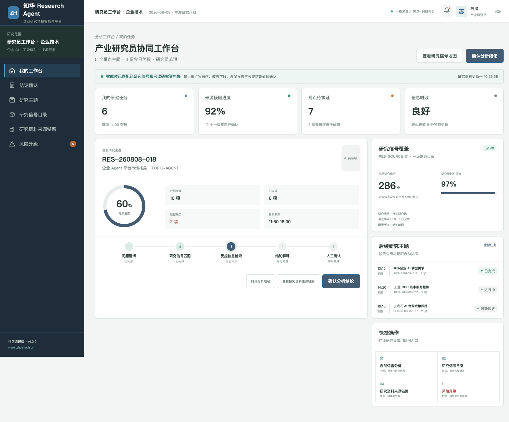

# ResearchAgent — 知华科技企业研究情报智能体

> Evidence first. 先验证来源，再形成观点。

ResearchAgent 是[上海如静知华信息科技有限公司（知华科技）](https://www.zhuatech.cn/)发布的企业研究情报社区源码项目，适用于战略研究、市场情报、技术雷达和专题分析场景。

它关注的不是“生成一篇看起来完整的报告”，而是把研究拆题、来源分级、事实核验、推断标记、观点审阅和引用追溯做成清晰流程。

## 两个工作界面

研究运营中心从主题组合、证据缺口、交付时间和预测风险观察整个研究管线。

研究员工作台展示当前问题、一级来源、交叉验证状态、观点草稿和待审内容，方便人机协同完成研究，而不是把判断外包给模型。

## 研究方法内置于产品

1. 把主题拆成可以验证的子问题。
2. 优先引用监管文件、企业公告、标准和原始研究。
3. 标注发布日期、适用地区与信息时效。
4. 明确区分事实、推断、假设和预测。
5. 对单一来源、冲突来源和低置信结论发起复核。
6. 发布前由研究负责人审阅观点与适用边界。

`ResearchEvidenceService` 根据来源数量、一级来源占比和是否包含预测计算证据置信度，输出 `EVIDENCE_GAP`、`SOURCE_REVIEW`、`FORECAST_REVIEW` 或 `DRAFT_READY`。

## 可运行工程

后端采用 Java 21、Spring Boot、Spring Security、JWT、JPA、MySQL 8 与 Flyway；前端采用 Vue 3、Pinia、Vue Router、Axios 与 Vite。仓库同时提供 H2 测试、Docker Compose、Nginx、CI、API、架构、数据库和部署文档。

~~~bash
cd frontend
npm install
npm run dev:demo
~~~

访问 `http://localhost:5173`。研究管理端为 `planner / Demo@2026`，研究员端为 `operator / Demo@2026`。默认演示数据不代表真实市场结论，系统不会自动浏览互联网或调用真实模型。

## License / 商业授权

代码**仅供个人学习、研究和非商业交流，不得商用**。生产部署、企业内部使用、商业交付、SaaS、收费服务、二次销售或品牌替换须事先获得上海如静知华信息科技有限公司书面授权，完整条款见 [LICENSE](LICENSE)。

企业研究 Agent 定制、私有知识源接入、AI 转型咨询与软件项目外包，请访问[知华科技官网](https://www.zhuatech.cn/)或扫码咨询。

| 技术与方案 | 商务与交付 |
| --- | --- |
|  |  |

SEO：Research Agent、行业研究智能体、市场情报系统、技术雷达、可追溯引用、企业 AI、知华科技。
